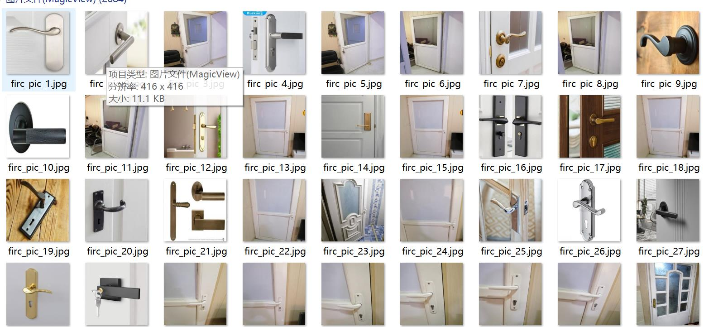
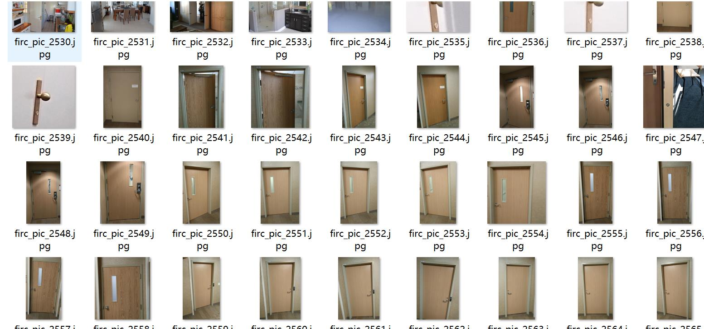
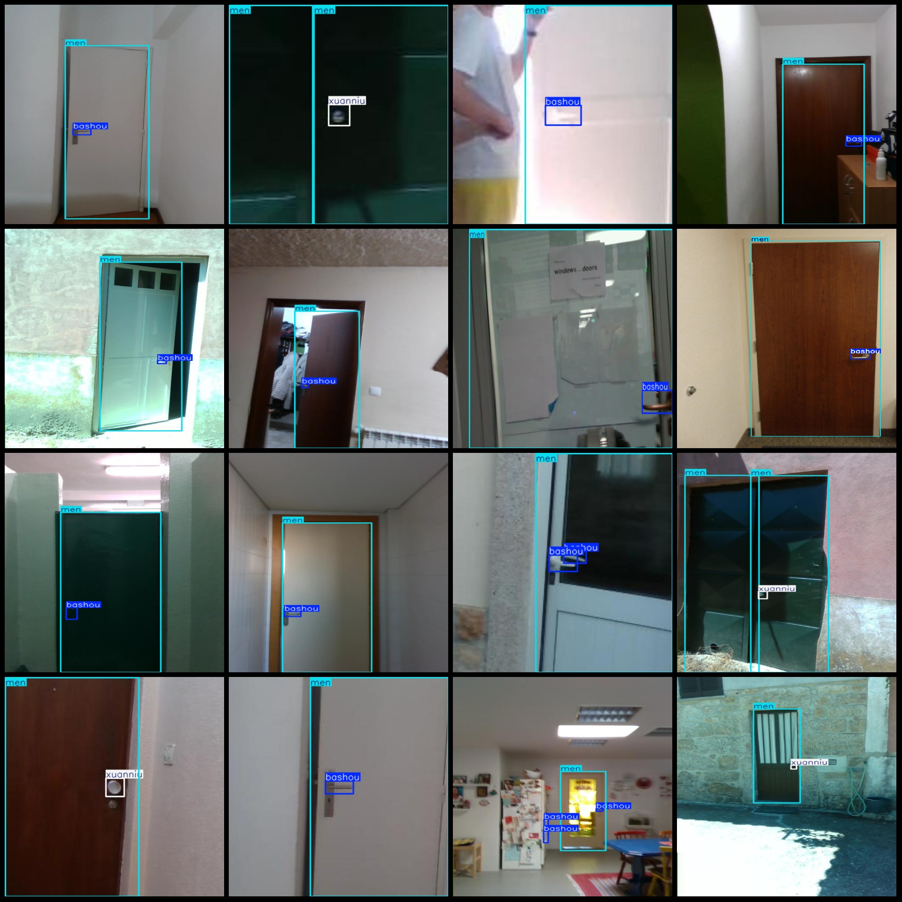
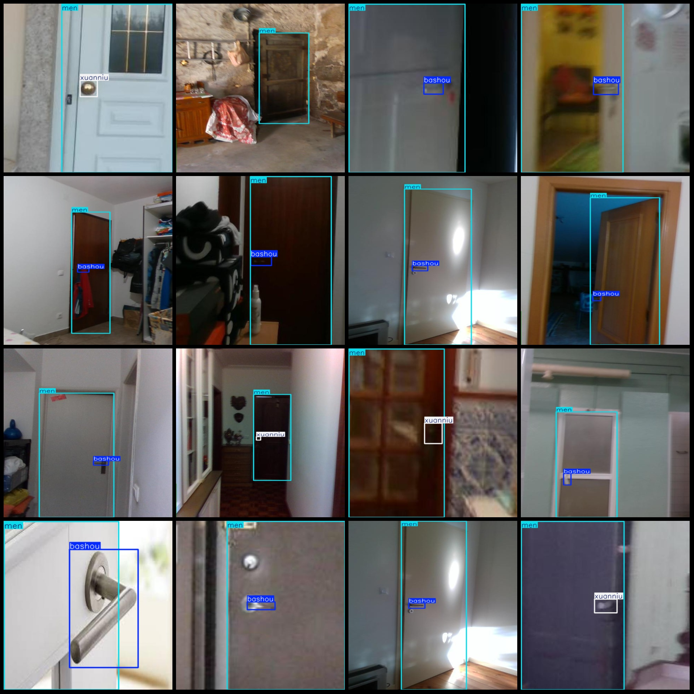

# Handbrake Detection Dataset - Pascal VOC+YOLO Format: 2684 Images in 3 Categories

The dataset format includes a Pascal VOC-like structure plus YOLO format (excluding the split path's .txt file, only containing .jpg images along with corresponding .xml VOC files and .txt YOLO 
files).

Number of images (jpg file count): 2684
Number of annotations (xml file count): 2684
Number of annotations (txt file count): 2684
Number of categories: 3
Annotation category names (note that the order of categories in the .txt file does not match this, but is based on the labels folder's classes.txt): ["bashou", "men", "xuanniu"]
Corresponding Chinese category names: ["handle", "door", "knob"]
Box count for each category:
- "bashou" box count = 2176
- "men" box count = 2979
- "xuanniu" box count = 803
Total box count: 5958
Number of images per category:
- "bashou" images per category = 1936
- "men" images per category = 2669
- "xuanniu" images per category = 693
Image resolutions: Images are in various resolutions, such as 640x480, 480x480, etc.
Annotation tool used: labelImg
Annotation rules: Draw bounding boxes for categories
Important note: The dataset does not have separate training, validation, or test sets; you will need to divide them yourself.
Special declaration: This dataset does not guarantee any precision in the trained models or weight files.
Image previews:
Annotation examples:

Image

Here is a pay link on Stripe ( https://buy.stripe.com/3cs8yP7sY87d0vu9AB ). Please contact me lonlonago@foxmail.com after funding $89, and I will send you a complete data files , thank you!

